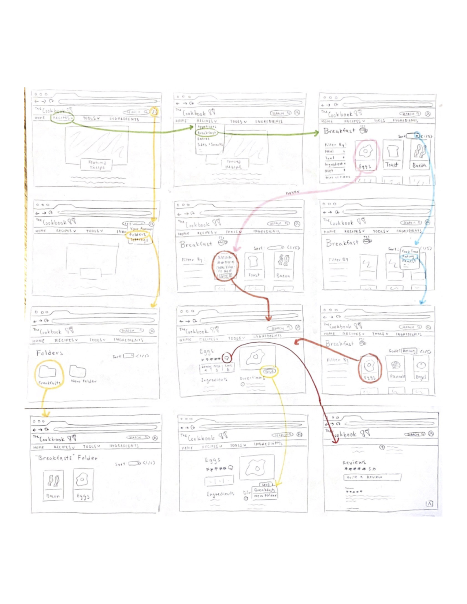

# DH150 Assignment 6: Low Fidelity Prototype
by Pawan (Sine) Polcharoen

---

## Project Description + Purpose
A brief description of your project and purpose of this low-fidelity prototype.

## Tasks Supported
A list of tasks that the (paper) prototype of your system supported.
1. Sort recipe search by rating/cook time/newest/etc.
2. Save recipes to folder on website.
3. Leave a rating and review on a recipe.

## Wireframes + Wireflow

## Testing
### Link to testing video
https://drive.google.com/file/d/12Iy1ZThWLE-5Hk9Ter5PRoP7_eUxbmyZ/view?usp=sharing

### Insights from testing

## Reflection
A description of what you would change or design differently based on the feedback you got from the prototype testing. For each, describe in a sentence or two 
what problem the tester encountered, and in another sentence or two how you would address the problem if you were to revise the prototype.
