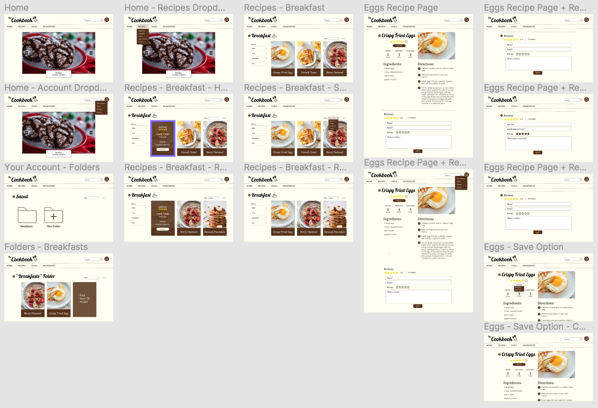
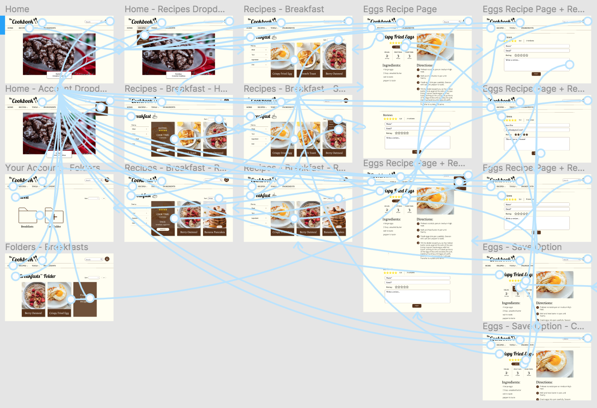
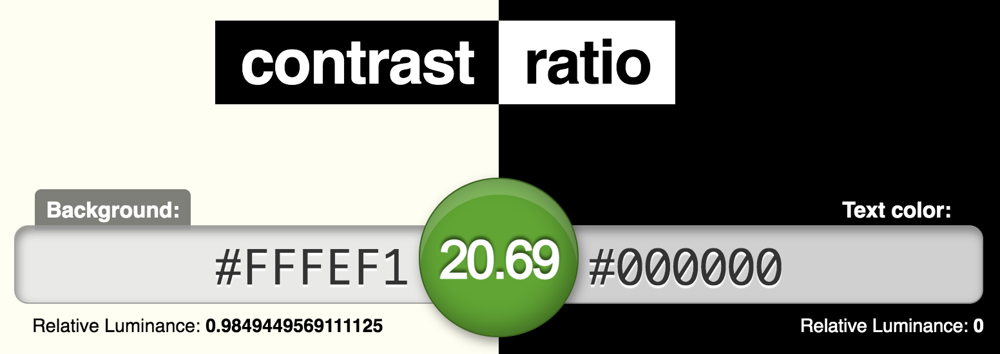
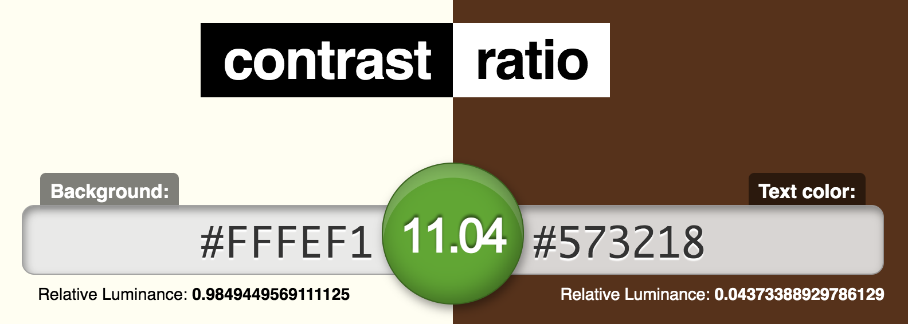
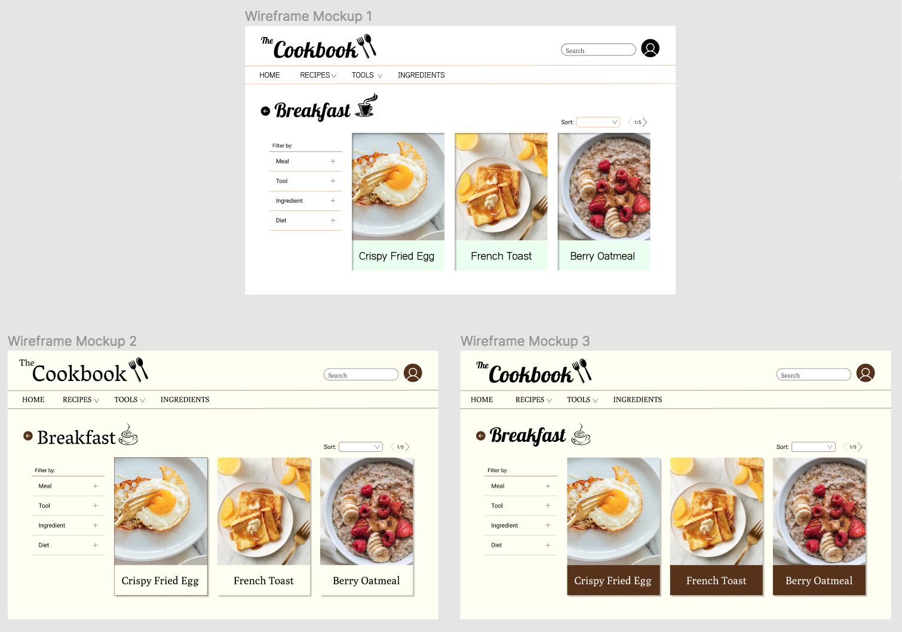

# DH150 Assignment 7: High Fidelity Prototype
by Pawan (Sine) Polcharoen

---

## Project Description
For this project, I will be prototyping a cooking website, "The Cookbook," geared towards middle aged women. My decisions regarding color scheme and interface design will be rooted in findings from my past evaluations, user testings, and persona scenarios. The purpose of creating a high fidelity prototype is to create actual interactive visuals for the final project and test its ability to support certain tasks. With this information, I will be able to tweak my designs to better support my target demographic. 

## Tasks Supported
1. Sort recipe search by level of rating.
2. Save recipe to "Breakfasts" folder on website and access that folder through your account.
3. Navigate to recipe page and leave a rating and review.

## The Prototype
**Link to final interactive Figma prototype:** https://www.figma.com/proto/VebjqMgBurBc1iV37WjSnU/The-Cookbook-Hi-fi-Prototype-Interactive?node-id=1%3A2&scaling=scale-down

**Link to version 1 of screen designs:** https://www.figma.com/file/pa0Vl0CtX9A4SOaUowiq8M/The-Cookbook-Hi-fi-Prototype-Version-1-Non-interactive?node-id=0%3A1

### Screen Designs

### Wireflows

## Decision-making Process
**Color Scheme:** For my screen designs, I chose a warm and neutral color scheme, consisting of a pale yellow background with white, brown, black accents. Initially, I was debating between a more bright and vibrant color scheme, but I decided to go with the more neutral option after the findings of my Impression Test. I feel that the neutral colors allow the photographs of the food to pop more, while creating a cozy and inviting aesthetic for the site overall. Using both brown and black allowed me to create a contrast between the text and the accent pieces; I used black to accent and visually draw users to the text and headings, while utilizing the brown for buttons and other design components. Moreover, I solidified my choice after checking the colors with the accesibility color contrast test. The results of this test can be found below.

**Fonts:** Initially, I used the Vesper Libre font as the main font for my logo and headers. However, after exploring more options on Figma and after my Impression Test, I decided on Galada. Galada gave more visual interest and brought a playful touch to the more serious neutral color scheme. For subheadings and body text, I used a mixture of Poly and Roboto font. I chose Poly because it was easy to read, but was still appealing to look at for headings. For my filters and body text, I chose Roboto because it is a simple font that is very easy to read, which I believe will be helpful for middle aged women that may struggle with reading on a device.

**Images and Icons:** For the images of the food, I focused on finding photographs with natural lightings and bright backgrounds. I found that this combination made the food look fresh and inviting. Furthermore, I chose simple monotone icons for logo, headers, and the save button. I believe these icons create interest and give personality to the site. The save and review icons are common icons that I hope will help users pick up on the button's usage without having to read any text.

### Accesibility Color Contrast Test

## Impression Test
**Link to impression test video:** https://drive.google.com/file/d/1sWmIU_yuUoXRW_hMr2Yv2Gb8faIEGF4L/view?usp=sharing

For the Impression Test, I presented the following three different mockups with various fonts and colors to my participant. Insights from the test can be found below. From the data collected, I decided to utilize the design choices in Mockup 3 for the rest of my screen designs.

### Summary of Impression Test
1. User prefers the neutral color scheme, since it is less harsh visually. Additionally, she prefers the brown recipe labels to the pale yellow becuase they give more visual contrast.
2. User prefers Galada font for the logo/headers instead of Vesper Libre. They also prefer Poly font for the body text instead of Hanuman. 
3. User prefers the coffee icon in mockups 2 and 3 instead of the one in mockup 1, because it does not take away from the main logo icon.

## Cognitive Walkthrough
**Link to cognitive walkthrough results:** https://docs.google.com/document/d/1pSl5zXvbbkcvP-2jW1eOf7fdbCkGc1iGmCV1o5la_0o/edit?usp=sharing

### Summary of Cognitive Walkthrough

## Reflection
