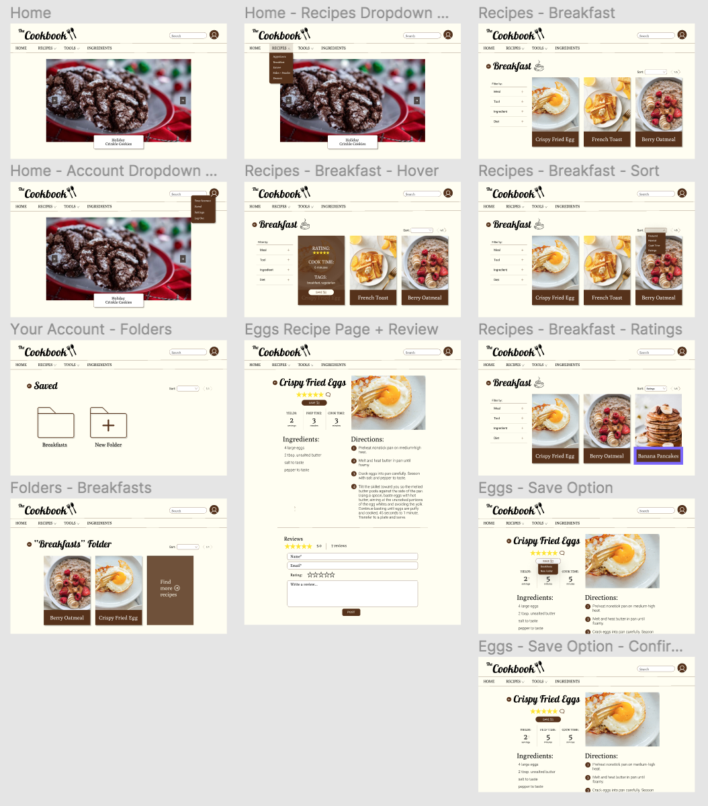
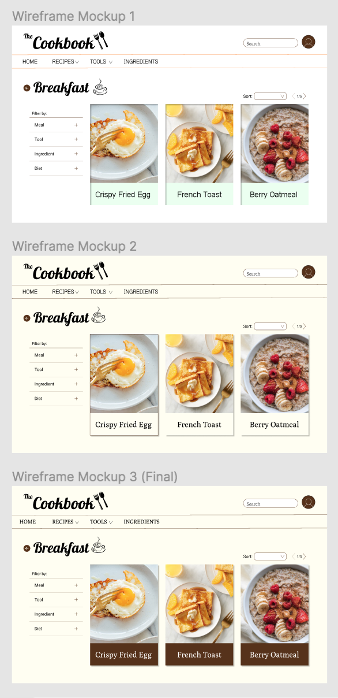

# DH150 Assignment 7: High Fidelity Prototype Part 1
by Pawan (Sine) Polcharoen

---

## Project Description
A brief description of your project, the purpose and process of this prototyping phase (3-5 sentences)
For this project, I will be prototyping a cooking website, "The Cookbook," geared towards middle aged women. My decisions regarding color scheme and interface design will be rooted in findings from my past evaluations, user testings, and persona scenarios. The purpose of creating a high fidelity prototype is to create actual interactive visuals for the final project and test its ability to support certain tasks. With this information, I will be able to tweak my designs to better support my target demographic. 

## Tasks Supported
1. Sort recipe search by rating/cook time/newest/etc.
2. Save recipes to folder on website and access that folder through your account.
3. Leave a rating and review on a recipe.

## Screen Designs
**Link to Figma Prototype:** https://www.figma.com/file/pa0Vl0CtX9A4SOaUowiq8M/The-Cookbook-Hi-fi-Prototype?node-id=0%3A1

## Decision-making Process
**Color Scheme:** For my screen designs, I chose a warm and neutral color scheme, consisting of a pale yellow background with white, brown, black accents. Initially, I was debating between a more bright and cibrant color scheme, but I decided to go with the more neutral option after the findings of my impression test. 

**Accesibility Color Contrast Test**

## Impression Test
**Link to impression test video:** https://drive.google.com/file/d/1sWmIU_yuUoXRW_hMr2Yv2Gb8faIEGF4L/view?usp=sharing

