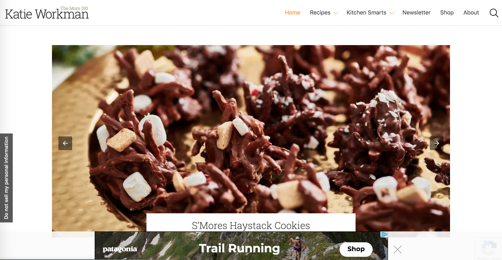
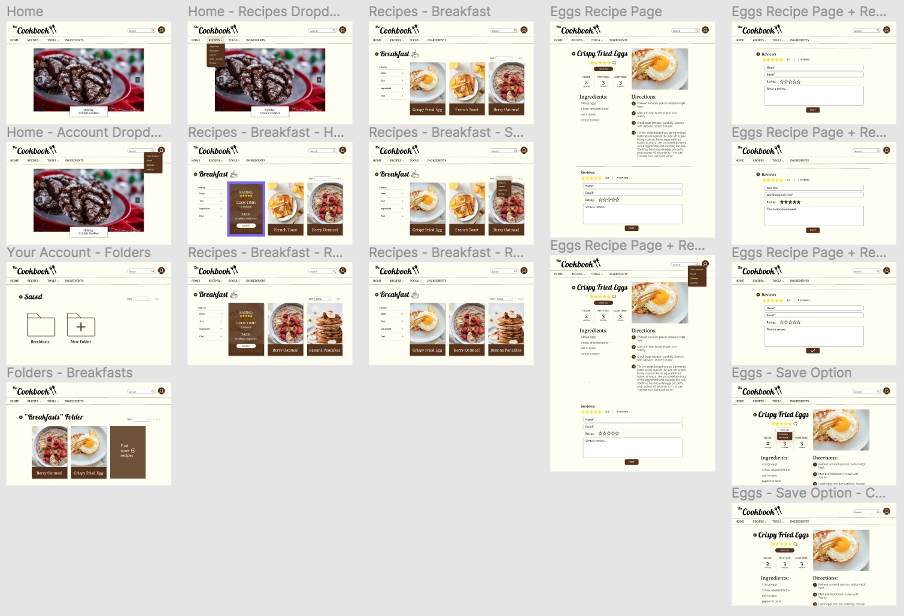
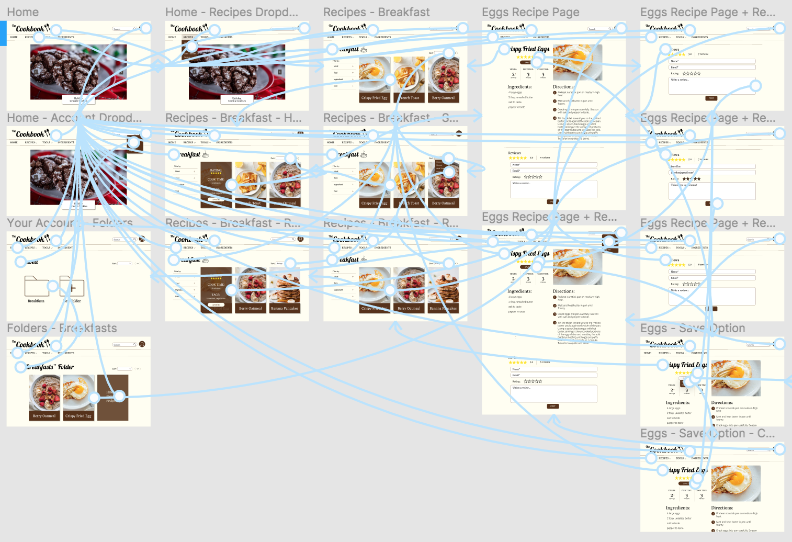

# The Cookbook Website
by Pawan (Sine) Polcharoen

---

## Introduction
The Cookbook is a cooking website that allows users to find and save recipes that appeal to them and their various lifestyles. Through careful analysis, testing, and prototyping, The overarching goal of The Cookbook is to create a stress-free environment for busy middle aged women, so that they can explore the cooking skill while easily implementing the recipes into their lives. The user personas I created were busy middle aged women with real-life responsibilities and concerns. I want the website I create to be easily accessible for women of all technical and cooking levels. I also strive to create something that will cater to users' specific needs regarding time constraints and dietary needs. 

## Design Statement
This UX Design project is focused around cooking websites geared towards middle aged women. Middle aged women often have a full plate of responsibilities. On an average day, they have to balance working, parenting, and countless other tasks. Since they are already dealing with so much, these women should be putting in the least amount of extra effort to navigate a cooking website that’s supposed to be designed for their demographic. Cooking, at the end of the day, should be easy and accessible, rather than a chore. Personally, I feel as though cooking should be a fun experience that one looks forward to. Thus, I chose to design my website, The Cookbook, for this project in an effort to create a comfortable environment for middle aged women to find recipes and cook at ease.

## Competitor Analysis
### Heuristic Evaluation
The two cooking websites I evaluated are "Mom On Timeout" and "The Mom 100." Although these websites differ in aesthetic and design, their problems tend to overlap in many categories. In a heuristic evaluation, I identified the ways in which these sites have violated the various heuristics, as well as identified the source of their problems and suggested potential solutions. After the evaluation, I found that the main issue on both websites was the excessive amount of writing content and advertisements, hindering both site's accessibility, aesthetic, and user freedom. [...read more](https://github.com/spolcharoen/DH150-PawanPolcharoen)

Mom on Timeout | The Mom 100
------------ | -------------
 | 

### UT Testing
The purpose of usability testing (UT) is to identify issues with the product design and improve the overall usability and satisfaction of a product. In contrast to heuristic evaluation, UT provides a more accurate inspection of how a random participant would interact with a product. The process is necessary to test whether a product is effective, efficient, and satisfactory for users. Furthermore, the UT process can also inform potential users about the unreleased project, as well as help identify problems in the interface early, eliminating possible future spending and damage control. For my UT, I continued my analysis of the “Mom on Timeout” food blog, asking my participant to complete three tasks that test the usability of the website. [...read more](https://github.com/spolcharoen/DH150-PawanPolcharoen/tree/main/Assignment2)

<iframe src="https://drive.google.com/file/d/1CsEw-kOSkRd8WgQfCtnYe3IyIFX3RVCZ/preview" width="440" height="280"></iframe>

## User Research: Contextual Inquiry
The research method I used in this user research was an interview with participartory observation. To prepare for the main interview, I wrote a contectual inquiry guide to help aid the process and clarify the purpose and goals of the study. This guide contains an introduction for the interview participant, as well as sets of questions revolving around background, context, user activity, and problems. These various sections are geared to learn more about the participant and how they find recipes online. In addition, they provide context to better understand the participant and why they make certain choices. [...read more](https://github.com/spolcharoen/DH150-PawanPolcharoen/tree/main/Assignment4)

<iframe src="https://drive.google.com/file/d/1U5aDV7L16qYTf2xqhic6-1k1tlgjj8Ou/preview" width="440" height="280"></iframe>

## UX Storytelling
Through UX storytelling, designers can gain a deeper understanding of the target user. This allows them to implement necessary changes to their product. For The Cookbook website, I created two personas within my target demographic of middle aged women: Kelly Penrose and Vivian Zhu. By creating these personas and stepping into the mind of these women, I gained insight into the thoughts and behaviors influencing how they interact with the website. My personas and scenarios utilize the following proposed features: search filters and a recipe saving tool. [...read more](https://github.com/spolcharoen/DH150-PawanPolcharoen/tree/main/Assignment5)

Kelly Penrose | Vivian Zhu
------------ | -------------
 | 
 | 

## Low Fidelity Prototype
The purpose of low fidelity prototyping testing is to better understand how target users will interact with the cooking website I am designing. I used the data from testing and persona/scenario development to aid me in the creation of The Cookbook and its interface design. I utilized low fideltity prototype testing to gauge whether my proposed features would be successful and useful or not. Through a series of three tasks, I was able to test my site's navigation and how users interact with the interface. The tasks supported in my prototype are (1) sort recipe search by rating/cook time/newest/etc., (2) save recipes to a folder on the website, and (3) leave a rating and review on a recipe. [...read more](https://github.com/spolcharoen/DH150-PawanPolcharoen/tree/main/Assignment6)

### Wireframes + Wireflow

## High Fidelity Prototype
Based on my low fidelity protype, I used the design tool, Figma, to build a high fidelity prototype for The Cookbook website. Using my findings from past evaluations, user testings, and persona scenarios, I made informed decisions regarding color scheme, fonts, and overall interface design. The purpose of creating a high fidelity prototype is to create interactive visuals for the final project and test its ability to support certain tasks. I tested my prototype throughout the process, conducting an [impression test](https://drive.google.com/file/d/1sWmIU_yuUoXRW_hMr2Yv2Gb8faIEGF4L/view?usp=sharing), [cognitive walkthrough](https://docs.google.com/document/d/1pSl5zXvbbkcvP-2jW1eOf7fdbCkGc1iGmCV1o5la_0o/edit?usp=sharing), and accessibility test. The final result is the interactive prototype below. The prototype supports the following three tasks: (1) sort recipe search by level of rating, (2) save recipe to folder on website and access that folder through your account, and (3) navigate to recipe page and leave a rating and review. [...read more](https://github.com/spolcharoen/DH150-PawanPolcharoen/tree/main/Assignment7)

<iframe style="border: 1px solid rgba(0, 0, 0, 0.1);" width="800" height="450" src="https://www.figma.com/embed?embed_host=share&url=https%3A%2F%2Fwww.figma.com%2Fproto%2FVebjqMgBurBc1iV37WjSnU%2FThe-Cookbook-Hi-fi-Prototype-Interactive%3Fnode-id%3D1%253A2%26scaling%3Dscale-down" allowfullscreen></iframe>

### Screen Designs

### Wireflows

## Evaluation and Revision History 
### Cognitive Walkthrough
The [cognitive walkthrough](https://docs.google.com/document/d/1pSl5zXvbbkcvP-2jW1eOf7fdbCkGc1iGmCV1o5la_0o/edit?usp=sharing) was conducted in class. I showcased the initial draft of my high fidelity prototype, along with the three tasks it supported, to two of my classmates. From there, I gathered feedback on my design, learning what was successful and what could be improved. My findings indicated inconsistencies with my rating and review task. Thus, I was able to fix this issue for my final prototype.

### Impression Test
For the [impression test](https://drive.google.com/file/d/1sWmIU_yuUoXRW_hMr2Yv2Gb8faIEGF4L/view?usp=sharing), I presented the following three different mockups with various fonts and colors to my participant. Insights from the test can be found [here](https://github.com/spolcharoen/DH150-PawanPolcharoen/blob/main/Assignment7/README.md). From the data collected, I decided to utilize the design choices in Mockup 3 for the rest of my screen designs.

### Accesibility Color Contrast Test
For my screen designs, I chose a warm and neutral color scheme, consisting of a pale yellow background with white, brown, black accents. I feel that the neutral colors allow the photographs of the food to pop more, while creating a cozy and inviting aesthetic for the site overall. Moreover, I solidified my choice after checking the colors with the accesibility color contrast test.

Black/Yellow test | Brown/Yellow test
------------ | -------------
 | 

## Conclusion + Reflection
Overall, I have learned a lot from the creation of this DH150 UX Design project. Although I came into the course with little to no knowledge about UX and UI, I feel that I have been able to gain many useful insights throughout the process. Firstly, I learned how critical the research and analysis processes are. Prior to even starting the actual product design, there is so much important work that needs to be done. Without fully understanding the current market and your target demographic, there is no evidence to back design choices. Without user-based research, the final product would be aimless and without goal. Furthermore, I also learned that it is impossible to please everyone. Although users may have similar end goals, everyone has different motivations and needs. Thus, compromises and choices have to made regarding interface design and features offered. Lastly, I have learned that all the processes regarding designing a product from scratch should tie back to the user. At the end of the day, the product is intended to be as useful and accessible as possible. This is the overarching goal that should resonate throughout any design project.

Throughout the process, I also gained a variety of practical research, design, and technical skills. I learned how to conduct many different evaluations and tests to analyze the usability of a product. Within these tests, I have also worked on my communication skills as a moderator and interviewer. Moreover, I learned how to use programs, such as Figma, to bring my designs to life. As I learn more about UX design and work on more projects in addition to The Cookbook, I hope to further develop thse skills, as well as explore others. 

Ultimately, the UX research and design process revolves around both creative and technical skills, and I feel that I have had to demonstrate my knowledge in both fields throughout the creation of my website. In the future, I hope to work further on The Cookbook, implementing new features in addition to working to perfect current ones. Looking back on what I accomplished over this quarter, I am proud of the work presented, and I feel that I have gained a deeper understanding of the UX design process, which I will be able to implement in my future works, courses, and projects.
