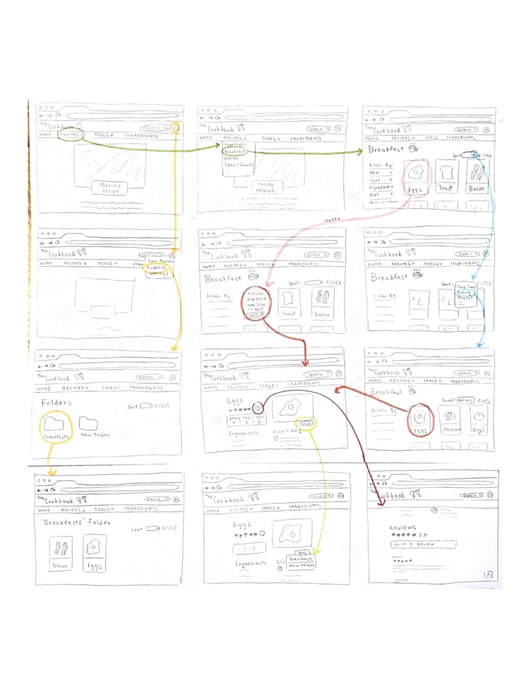
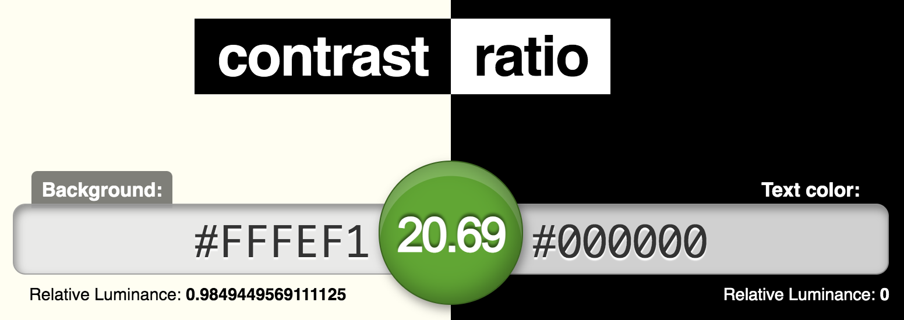

# DH150 Web Documentation: The Cookbook Website
by Pawan (Sine) Polcharoen

---

## Introduction
The Cookbook is a cooking website that allows users to find and save recipes that appeal to them and their various lifestyles. The website is geared towards middle aged women. I wanted to create The Cookbook in an effort to ease the lives of these busy middle aged women and create a stress-free environment for them to explore the cooking skill while easily implementing the recipes into their lives.

## Design Statement
This UX Design project will be focused around cooking websites geared towards middle aged women. Middle aged women often have a full plate of responsibilities. On an average day, they have to balance working, parenting, and countless other tasks. On top of all that, these women should be putting in the least amount of extra effort to navigate a cooking website that’s supposed to be designed for their demographic. Cooking at the end of the day should be easy and accessible, rather than a chore. Personally, I feel as though cooking should be a fun experience that one looks forward to. Thus, I want to improve the UX design of such websites over this quarter in an effort to create a comfortable environment for middle aged women to find recipes and cook at ease.

## Competitor Analysis: Heuristic Evaluation
The two cooking websites I will be evaluating are "Mom On Timeout" and "The Mom 100." Although these websites differ in aesthetic and design, their problems tend to overlap in many categories. In this [heuristic evaluation](https://github.com/spolcharoen/DH150-PawanPolcharoen), I hope to identify the ways in which these sites have violated the various heuristics, as well as identify the source of the problem and suggest a potential solution. 

Mom on Timeout | The Mom 100
------------ | -------------
 | 

## Competitor Analysis: UT Testing
The purpose of [usability testing](https://github.com/spolcharoen/DH150-PawanPolcharoen/tree/main/Assignment2) (UT) is to identify issues with the product design and improve the overall usability and satisfaction of a product. In contrast to heuristic evaluation, UT provides a more accurate inspection of how a random participant would interact with a product. It is necessary to test whether a product is effective, efficient, and satisfactory for users. The UT process can also inform potential users about the unreleased project, as well as help identify problems in the interface early, eliminating possible future spending and damage control.

<iframe src="https://drive.google.com/file/d/1CsEw-kOSkRd8WgQfCtnYe3IyIFX3RVCZ/preview" width="640" height="480"></iframe>

## User research: Contextual Inquiry
The research method used in this [user research](https://github.com/spolcharoen/DH150-PawanPolcharoen/tree/main/Assignment4) is an interview with participartory observation. To prepare for the main interview, I wrote a contectual inquiry guide to help aid the process and clarify the purpose and goals of the study. This guide contains an introduction for the interview participant, as well as sets of questions revolving around background, context, user activity, and problems. These various sections are geared to learn more about the participant and how they find recipes online. In addition, they provide context to better understand the participant and why they make certain choices.

## UX storytelling
The purpose of [UX storytelling](https://github.com/spolcharoen/DH150-PawanPolcharoen/tree/main/Assignment5) is to give the designer a deeper understanding of the user so that they can implement necessary changes to their product. By creating personas and stepping into the mind of a potential user, designers gain insight into the thoughts and behaviors that influence how a user interacts with the product. The process can allow us to think though the decision-making process that users go through when accessing the product. Specifically for my project, UX storytelling will allow me to empathize with the various challenges that my target users may face. Thus, I can make changes and introduce features that will combat these obstacles and allow for an improved user experience overall.

Kelly Penrose | Vivian Zhu
------------ | -------------
 | 
 | 

## Low-fidelity prototype
The purpose of this [low fidelity prototype](https://github.com/spolcharoen/DH150-PawanPolcharoen/tree/main/Assignment6) testing is to better understand how target users will interact with the cooking website I am designing. From past testing and persona/scenario development, I have gathered data that will aid me in the creation of my website and the guide me in the decisions I make regarding the interface design. I will be utilizing low fideltity prototype testing to see whether certain features I want to implement are successful and useful. Through a series of tasks, I will gain a deeper understanding of how easy my site is to navigate and how users interact with the interface.

The user personas I created were busy middle aged women with real-life responsibilities and concerns. I want the website I create to be easily accessible for women of all technical and cooking levels. I also strive to create something that will cater to users' specific needs regarding time constraints and dietary needs. Thus, the features I wanted to implement are a sort/filter option while searching, a save-to-folder feature that is connected to a personal account on the site, and a rating/review system for each recipe.

### Wireframes + Wireflow

## High-fidelity prototype
For this project, I will be designing a [high-fidelity prototype](https://github.com/spolcharoen/DH150-PawanPolcharoen/tree/main/Assignment7) for a cooking website, "The Cookbook," geared towards middle aged women. My decisions regarding color scheme and interface design will be rooted in findings from my past evaluations, user testings, and persona scenarios. The purpose of creating a high fidelity prototype is to create interactive visuals for the final project and test its ability to support certain tasks. With this information, I will be able to tweak my designs to better support my target demographic and the tasks they want to complete. 

<iframe style="border: 1px solid rgba(0, 0, 0, 0.1);" width="800" height="450" src="https://www.figma.com/embed?embed_host=share&url=https%3A%2F%2Fwww.figma.com%2Fproto%2FVebjqMgBurBc1iV37WjSnU%2FThe-Cookbook-Hi-fi-Prototype-Interactive%3Fnode-id%3D1%253A2%26scaling%3Dscale-down" allowfullscreen></iframe>

### Screen Designs

### Wireflows

## Evaluation and Revision History 
### Cognitive Walkthrough
**Link to cognitive walkthrough results:** https://docs.google.com/document/d/1pSl5zXvbbkcvP-2jW1eOf7fdbCkGc1iGmCV1o5la_0o/edit?usp=sharing

### Impression Test
**Link to impression test video:** https://drive.google.com/file/d/1sWmIU_yuUoXRW_hMr2Yv2Gb8faIEGF4L/view?usp=sharing

For the Impression Test, I presented the following three different mockups with various fonts and colors to my participant. Insights from the test can be found [here](https://github.com/spolcharoen/DH150-PawanPolcharoen/blob/main/Assignment7/README.md). From the data collected, I decided to utilize the design choices in Mockup 3 for the rest of my screen designs.

### Accesibility Color Contrast Test

## Pitch video [update the video after recording your presentation]

## Conclusion + Reflection
Overall, creating and designing a high fidelity prototype for "The Cookbook" website was very informative and fun! The whole process went very smoothly. I was able to create different designs and test them as I went. I enjoyed taking feedback from the impression test and the cognitive walkthrough and implementing changes in my screen designs and wireflow.
