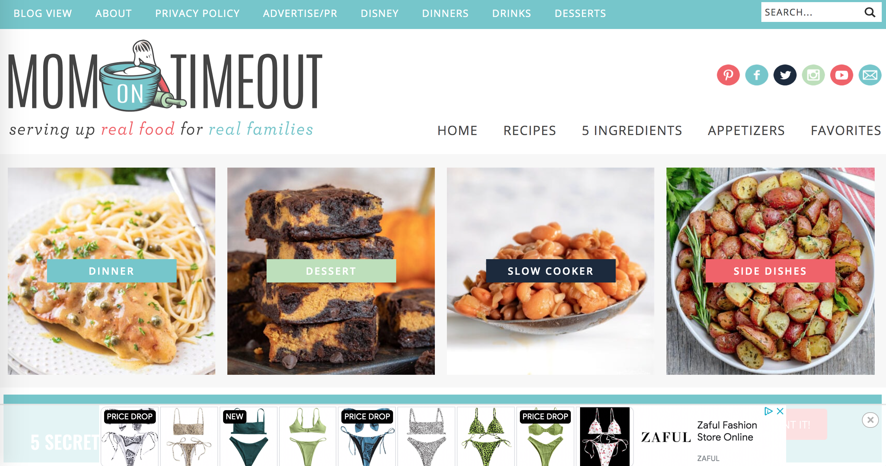
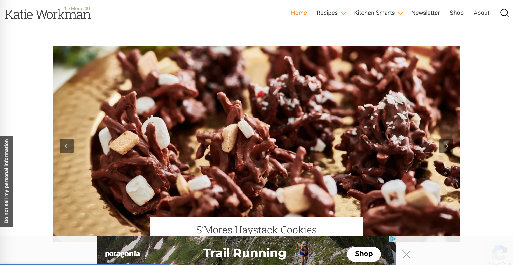

# Digital Humanities 150: User Experience Design
DH150 Website by Pawan (Sine) Polcharoen

---

# Cooking Sites for Middle Aged Women
**Project Description:** This UX Design project will be focused around cooking websites geared towards middle aged women. Middle aged women often have a full plate of responsibilities. On an average day, they have to balance working, parenting, and countless other tasks. On top of all that, these women should be putting in the least amount of extra effort to navigate a cooking website that’s supposed to be designed for their demographic. Cooking at the end of the day should be easy and accessible, rather than a chore. Personally, I feel as though cooking should be a fun experience that one looks forward to. Thus, I want to improve the UX design of such websites over this quarter in an effort to create a comfortable environment for middle aged women to find recipes and cook at ease.

---
## Assignment 1: Heuristic Evaluation
The two cooking websites I will be evaluating are "Mom On Timeout" and "The Mom 100." Although these websites differ in aesthetic and design, their problems tend to overlap in many categories. In this heuristic evaluation, I hope to identify the ways in which these sites have violated the various heuristics, as well as identify the source of the problem and suggest a potential solution.

## Website 1: Mom On Timeout
"Mom On Timeout" is a food blog founded and run by Trish, a stay-at-home mom of two sons. Since July 2011, she has been posting family-friendly recipes for busy moms, specializing in short ingredient lists and time savers.

**Link to webpage:** https://www.momontimeout.com/

**Initial Overall Evaluation:** When I first go on "Mom On Timeout," I immediately notice the fun and bright colors used. This website is very inviting, but far from minimalistic. Navigation was straight-forward, with many options to search or find subpages. However, a problem I noticed quickly was the large amounts of writing and advertisements on each recipe page. The excess content made it difficult to focus on the recipe itself. Ultimately, I found the website to be very charming and easy to navigate, though there are definitely places where it could be more catered towards the heuristics.

### 1. Visibility of System Status
Severity (1-3) | Problem | Recommendation
------------ | ------------- | -------------
2 | The menu bar is only visible at the top of the webpage and disappears while scrolling. This would result in confusion for the user about what page they are on. | Have the menu bar stay at the top of the webpage as the user scrolls down. In addition, there could be button to close the menu bar if the user does not wish to see it while scrolling.
1 | After clicking on a page from the menu bar and being redirected, there is no visual change on the menu to indicate what page the user is on. | Have the page title in the menu bar highlighted in a different color when the user is on that specific page.
1 | When clicking on a recipe, there is no visual indication presented other than the clicker mouse changing. Other buttons on the website tend to change color when hovered on. Clicking a recipe should have the same high visibility of status. | Change the font from blue to orange when hovered on.

### 2. Match Between System and the Real World
Severity (1-3) | Problem | Recommendation
------------ | ------------- | -------------
2 | The menu bar has a page titled “DISNEY.” To someone unfamiliar with the creator’s Disney inspired recipes, this could be confusion as Disney is not usually associated with food and recipes. | Move “DISNEY” to a subcategory under the “RECIPES” page or retitle the page “DISNEY RECIPES” for more clarity.
1 | At the bottom of every recipe page, there are buttons to see the previous and next recipe pages. These buttons are stacked on top of each other instead of placed side-by-side. This is counterintuitive to what a user would naturally associate with previous and next commands, which are usually placed side-by-side. | Place the links in the same row.

### 3. User Control and Freedom
Severity (1-3) | Problem | Recommendation
------------ | ------------- | -------------
1 | There is no obvious way to clear a comment or undo writing in the comment and replies section under each recipe. | Add a “Clear Comment” button.
2 | The menu bar is only visible at the top of the webpage and disappears while scrolling. This makes is difficult for users to redirect to a different page if they want to. | Have the menu bar stay at the top of the webpage as the user scrolls down. In addition, there could be button to close the menu bar if the user does not wish to see it while scrolling.
3 | Ads are placed sporadically throughout the blog articles and recipes, making it hard for users to concentrate on the main content of the website. Plus, it is easy to accidentally click on an ad while reading a recipe post. | Place ads strictly in the sidebar, instead of dispersed within the writing content to avoid confusion.

### 4. Consistency and Standards
Severity (1-3) | Problem | Recommendation
------------ | ------------- | -------------
1 | The magnifying glass in the search bar is not clickable. Usually, this symbol is clickable to search in other similar websites. | Make the magnifying glass a button to search.
1 | Within the subpages of the website, there is no option to filter searches by ingredients or tools. More mainstream cooking sites tend to have this option. | Create a “filter by” option when searching.

### 5. Error Prevention
Severity (1-3) | Problem | Recommendation
------------ | ------------- | -------------
1 | When writing a comment or reply at the bottom of a recipe post, there is no spell-check tool or typo recognition. Thus, users would not be able to easily identify mistakes in their writing. | Add spell-check tool.
3 | Due to the scattered placement of ads through the blog posts and website in general, it is easy for the user to mistakenly click on an ad and be redirected without warning. | Either separate ads from the main writing and photographic content of the website, or add a confirmation before redirecting the user.

### 6. Recognition Rather than Recall
Severity (1-3) | Problem | Recommendation
------------ | ------------- | -------------
2 | While searching, there is no auto-complete or suggestions offered to help aid the search process. Instead, users have to recall what they want to search entirely on their own. | Add an auto-complete tool that suggests searches to the user based on what they have typed.

### 7. Flexibility and Efficiency of Use
Severity (1-3) | Problem | Recommendation
------------ | ------------- | -------------
2 | Although there are subpages for different meals and courses, there is no option to filter for certain ingredients of tools. This lowers the speed in which users can search for a recipe of their liking and also decreases the interaction speed for an expert user. | Create a “filter by” option when searching.
2 | There is no quick way to access the reviews and comments of the recipe other than scrolling to the bottom of the page. This decreases the interaction speed for all users. | Include a “Jump to Reviews” button at the top of the recipe page.

### 8. Aesthetic and Minimalist Design
Severity (1-3) | Problem | Recommendation
------------ | ------------- | -------------
3 | Before each recipe, there are paragraphs of writing content that the user has to scroll through. This information is not usually very helpful and competes with the core information. | Either place the writing content below the recipe or condense it.
3 | Due to the fact that ads are placed throughout the writing content across the website, the website is very cluttered with various visuals that distract from the main content. | Place ads strictly in the sidebar, instead of dispersed within the writing content to avoid confusion.
1 | This site has three different search bars which all function the same. This is unnecessary; one search bar in the header is enough. | Keep just the search bar in the header and delete the others.
1 | This site has two menu bars on the top of the web page. This is confusion and makes the homepage cluttered. | Choose a few key pages between the two menu bars and combine them into one.

### 9. Help Users Recognize, Diagnose, and Recover from Errors
Severity (1-3) | Problem | Recommendation
------------ | ------------- | -------------
1 | When writing a comment or reply at the bottom of a recipe post, there is no spell-check tool or typo recognition. Thus, users would not be able to easily identify mistakes in their writing. | Add spell-check tool.
1 | After submitting a comment or reply, there is no option to cancel or delete it. | Add an undo button.
1 | After signing up for the email list, there is no option to cancel or undo it. | Add an undo button.

### 10. Help and Documentation
Severity (1-3) | Problem | Recommendation
------------ | ------------- | -------------
3 | On the recipe pages, there is too much information presented and it is overwhelming. In addition to the recipe, there are multiple ads and multiple paragraphs of writing included. | Condense the writing portion, move the recipe to the top of the page, and reorganize ads so that they do not clutter the main content.
1 | Although there is an option to contact the creator, there is no official Help Center or FAQ section. | Add a help center or FAQ section.

---
## Website 2: The Mom 100
"The Mom 100" is the second website I will be evaluating. It is another food blog created by Katie Workman, a cook, a writer, and a mother of two. In contrast to Trish, Workman and her blog are much more involved in mainstream news, having been featured in Food52, NBC News, and other publications. In addition to the blog, Workman has also published two cookbooks.

**Link to webpage:** https://themom100.com/

**Initial Overall Evaluation:** At first glance, "The Mom 100" is a very clean and visually-pleasing website. Navigating through the various pages is relatively easy, especially with the well-organized menu bar. One thing I really enjoyed were the large photographs that complement the home-cooking feel. When looking at specific recipes, I immediately notice the overwhelming amount of information presented in the form of writing content and advertisements. This is something that I will look into further in the evaluation. Overall, I found the site to be easy to navigate and easy to search through for the most part.

### 1. Visibility of System Status
Severity (1-3) | Problem | Recommendation
------------ | ------------- | -------------
2 | When hovered above and clicked, the arrows in the slideshows across the website give no visual indication that the user is actively over a button. The mouse does not change and neither does the design. | Have the mouse clicker change, as well as the arrow highlight or bolded when hovered above or clicked on.

### 2. Match Between System and the Real World
Severity (1-3) | Problem | Recommendation
------------ | ------------- | -------------
1 | The menu bar has a page titled, “Kitchen Smarts,” which contains cooking basics and tips. This terminology could be confusing to new users. | Title the page a more universal title, such as “Cooking Basics” or “Kitchen Basics.”
2 | At the top of every recipe page, there is a downwards arrow that lets the user skip the blog writing and jump straight to the recipe. Although helpful, this button is not labeled “Jump to Recipe,” but instead is just the downward arrow. Users who are unfamiliar with cooking websites are not likely to know what the function of this button is. | Add a “Jump to Recipe” label to the arrow.

### 3. User Control and Freedom
Severity (1-3) | Problem | Recommendation
------------ | ------------- | -------------
1 | There is no obvious way to clear a comment or undo writing in the comment and replies section under each recipe. | Add a “Clear Comment” button.
3 | Ads are placed sporadically throughout the blog articles and recipes, making it hard for users to concentrate on the main content of the website. Plus, it is easy to accidentally click on an ad while reading a recipe post. | Place ads strictly in the sidebar, instead of dispersed within the writing content to avoid confusion.

### 4. Consistency and Standards
Severity (1-3) | Problem | Recommendation
------------ | ------------- | -------------
1 | On the top menu bar, the page names are located on the right rather than the left. Most other websites put these options on the left, so users of The Mom 100 would have to adapt, which is unnecessary. | Move the menu bar buttons to the left side.
1 | There are no subcategories or subpages pertaining to specific cooking tools/appliances. (i.e. Slow Cooker, Air Fryer, etc.) | Create subcategory pertaining to specific kitchen tools and appliances.
1 | This website also includes a menu bar at the bottom of every page. However, this menu bar is ordered differently than the header, which may cause some confusion for users. | Reorder the bottom menu to match the header.
1 | The “Newsletter” page is formatted differently than the rest of the website. This can be jarring for users since it is an unexpected change. | Add a warning for users to confirm before being redirected to the “Newsletter” page or lay out the page more similarly to the rest of the site.

### 5. Error Prevention
Severity (1-3) | Problem | Recommendation
------------ | ------------- | -------------
1 | When writing a comment or reply at the bottom of a recipe post, there is no spell-check tool or typo recognition. Thus, users would not be able to easily identify mistakes in their writing. | Add spell-check tool.
3 | Due to the scattered placement of ads through the blog posts and website in general, it is easy for the user to mistakenly click on an ad and be redirected without warning. | Either separate ads from the main writing and photographic content of the website, or add a confirmation before redirecting the user.

### 6. Recognition Rather than Recall
Severity (1-3) | Problem | Recommendation
------------ | ------------- | -------------
2 | While searching, there is no auto-complete or suggestions offered to help aid the search process. Instead, users have to recall what they want to search entirely on their own. | Add an auto-complete tool that suggests searches to the user based on what they have typed.

### 7. Flexibility and Efficiency of Use
Severity (1-3) | Problem | Recommendation
------------ | ------------- | -------------
2 | Although there are subpages for different meals and courses, there is no option to filter for certain ingredients of tools. This lowers the speed in which users can search for a recipe of their liking and also decreases the interaction speed for an expert user. | Create a “filter by” option when searching.
2 | There is no quick way to access the reviews and comments of the recipe other than scrolling to the bottom of the page. This decreases the interaction speed for all users. | Include a “Jump to Reviews” button at the top of the recipe page.

### 8. Aesthetic and Minimalist Design
Severity (1-3) | Problem | Recommendation
------------ | ------------- | -------------
3 | Before each recipe, there are paragraphs of writing content that the user has to scroll through. This information is not usually very helpful and competes with the core information. | Either place the writing content below the recipe or condense it.
3 | Due to the fact that ads are placed throughout the writing content across the website, the website is very cluttered with various visuals that distract from the main content. | Place ads strictly in the sidebar, instead of dispersed within the writing content to avoid confusion.

### 9. Help Users Recognize, Diagnose, and Recover from Errors
Severity (1-3) | Problem | Recommendation
------------ | ------------- | -------------
1 | When writing a comment or reply at the bottom of a recipe post, there is no spell-check tool or typo recognition. Thus, users would not be able to easily identify mistakes in their writing. | Add spell-check tool.
1 | After submitting a comment or reply, there is no option to cancel or delete it. | Add an undo button.
1 | After clicking on the "Newsletter" page, there is no "back" button on the page, even though the page is laid out differently than the rest of the website. | Add a "back" button.

### 10. Help and Documentation
Severity (1-3) | Problem | Recommendation
------------ | ------------- | -------------
3 | On the recipe pages, there is too much information presented and it is overwhelming. In addition to the recipe, there are multiple ads and multiple paragraphs of writing included. | Condense the writing portion, move the recipe to the top of the page, and reorganize ads so that they do not clutter the main content.
1 | Although there is an option to contact the creator, there is no official Help Center or FAQ section. | Add a help center or FAQ section.
